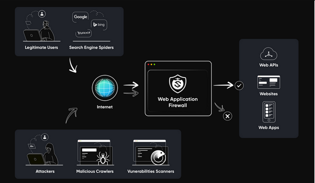
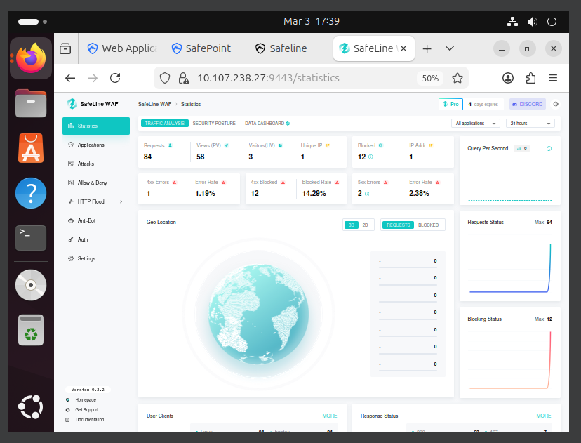

# WAF Attack Detection & Mitigation Lab

## Overview

This project demonstrates how a **Web Application Firewall (SafeLine WAF)** can detect and block malicious web attacks against a vulnerable web application.

A vulnerable environment was created using **DVWA (Damn Vulnerable Web Application)** running on an Apache web server. Two attack scenarios were simulated:

- SQL Injection
- Command Injection

The SafeLine WAF was then configured as a **reverse proxy security layer** to inspect incoming traffic and block malicious requests before they reached the backend application.

---

## Lab Environment

| Component | Description |
|----------|-------------|
| Kali Linux | Attacker machine used to simulate web attacks |
| Ubuntu Server | Web server hosting DVWA |
| Apache | Backend web server |
| MySQL | Database for DVWA |
| SafeLine WAF | Web Application Firewall protecting the server |
| VirtualBox | Virtual lab environment |

---

## Architecture Overview

This lab demonstrates how a Web Application Firewall protects a vulnerable web application by filtering malicious traffic before it reaches the backend server.

### Before WAF (Vulnerable Architecture)

        Attacker
            │
            ▼
    Web Server (Apache)
            │
            ▼
    DVWA Application
            │
            ▼
       MySQL Database


 
In this architecture the web server is **directly exposed to the internet**, allowing attackers to exploit vulnerabilities such as SQL Injection or Command Injection.

---

### After WAF (Protected Architecture)

### After WAF (Protected Architecture)

```
        Attacker
            │
            ▼
   SafeLine WAF (HTTPS - 443)
            │
            ▼
   Web Server (Apache - 8080)
            │
            ▼
       DVWA Application
            │
            ▼
        MySQL Database
```

The WAF acts as a **reverse proxy security layer**, inspecting incoming HTTP requests and blocking malicious payloads before they reach the backend application.


The WAF acts as a **reverse proxy security layer**, inspecting incoming HTTP requests and blocking malicious payloads before they reach the backend application.

---

### Architecture Diagram



---

## Attack Scenario 1 – SQL Injection

SQL Injection occurs when an attacker injects malicious SQL queries into application input fields to manipulate backend database queries.

### Successful SQL Injection (Before WAF)

The vulnerable application accepts malicious input and returns database records.


---

## Attack Scenario 2 – Command Injection

Command Injection allows attackers to execute system commands on the web server through vulnerable application inputs.

### Successful Command Execution (Before WAF)

The injected command is executed on the server.


---

## WAF Protection

After enabling SafeLine WAF, malicious requests were inspected and blocked before reaching the backend application.

### SQL Injection Blocked by WAF

The firewall detected malicious request patterns and returned an **Access Forbidden** response.


---

## WAF Monitoring Dashboard

SafeLine WAF provides monitoring capabilities that allow administrators to view request statistics and blocked attack attempts.



---

## Skills Demonstrated

- Web Application Security Testing
- OWASP Top 10 vulnerability analysis
- SQL Injection attack simulation
- Command Injection attack simulation
- Web Application Firewall deployment
- Reverse proxy security architecture
- Security monitoring and attack detection

---

## Tools Used

- SafeLine WAF  
- DVWA (Damn Vulnerable Web Application)  
- Kali Linux  
- Ubuntu Server  
- Apache Web Server  
- MySQL Database  
- VirtualBox  

---

## Key Takeaway

This lab demonstrates how **Web Application Firewalls improve web security by inspecting incoming requests and blocking malicious payloads before they reach vulnerable applications**.

By adding a WAF layer, organizations can significantly reduce the risk of exploitation from common web attacks such as SQL injection and command injection.
