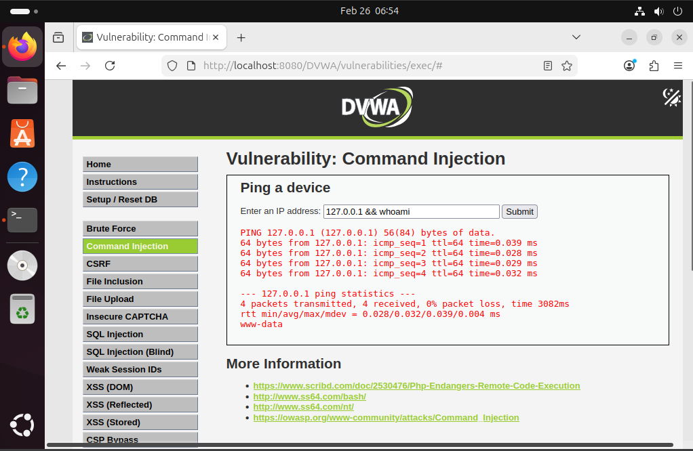

# Command Injection Investigation

## Overview

This document analyzes a **Command Injection vulnerability** discovered in the DVWA (Damn Vulnerable Web Application) environment during security testing.

Command Injection allows attackers to execute arbitrary system commands on a server by manipulating input fields that interact with the operating system.

This vulnerability is classified under the **OWASP Top 10 – Injection category**.

---

## Lab Environment

| Component | Description |
|--------|-------------|
| Attacker Machine | Kali Linux |
| Target Server | Ubuntu |
| Web Server | Apache |
| Application | DVWA |
| Security Layer | SafeLine WAF |

---

## Vulnerability Description

The DVWA application contains a feature that allows users to **ping a device by entering an IP address**.

The application fails to properly sanitize user input before passing it to the system shell.

This allows an attacker to append system commands to the input field.

Example behavior:

If the input is not sanitized, the system may execute additional commands.

---

## Attack Demonstration (Before WAF)

An attacker submits a crafted input into the DVWA command injection field.

Result:

- The server executes the command
- System-level information becomes accessible

### Evidence

*Figure: Command injection executed successfully before WAF protection.*

---

## Security Risk

If exploited in a real environment, this vulnerability could allow an attacker to:

- Execute arbitrary commands
- Access sensitive system files
- Escalate privileges
- Install malware
- Gain full control of the server

---

## WAF Protection

After enabling the SafeLine Web Application Firewall:

- The malicious request is detected
- The request is blocked before reaching the application
- The server remains protected

---

## Mitigation Techniques

To prevent command injection vulnerabilities:

| Mitigation | Description |
|-----------|-------------|
| Input validation | Restrict allowed input characters |
| Parameterized commands | Avoid direct shell execution |
| Escaping input | Sanitize user supplied data |
| Web Application Firewall | Detect and block malicious requests |

---

## Conclusion

This investigation demonstrates how improper input validation can lead to command injection vulnerabilities.

By deploying a Web Application Firewall and implementing secure coding practices, organizations can significantly reduce the risk of exploitation.
