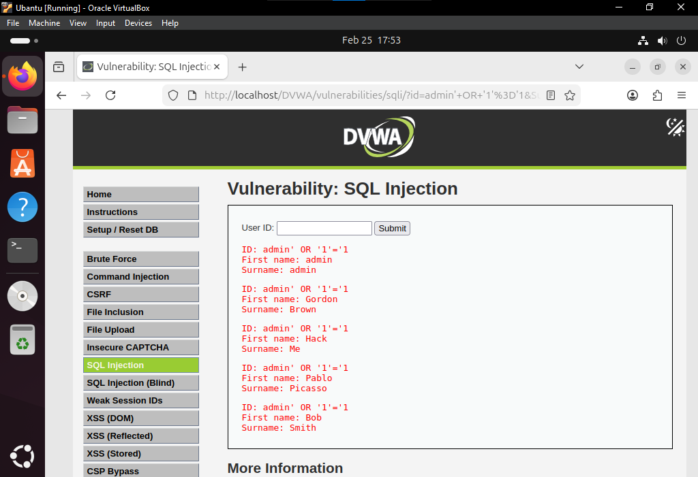
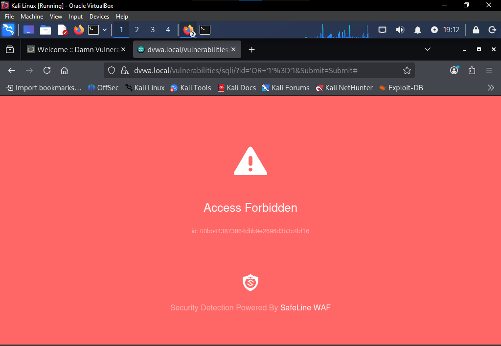

# SQL Injection Investigation

## Overview

This document analyzes a **SQL Injection vulnerability** discovered in the DVWA (Damn Vulnerable Web Application) environment during security testing.

SQL Injection occurs when user input is improperly handled and inserted directly into database queries.

Attackers can manipulate these queries to access or modify database information.

SQL Injection is part of the **OWASP Top 10 Injection vulnerabilities**.

---

## Lab Environment

| Component | Description |
|--------|-------------|
| Attacker Machine | Kali Linux |
| Target Server | Ubuntu |
| Web Server | Apache |
| Application | DVWA |
| Database | MySQL |
| Security Layer | SafeLine WAF |

---

## Vulnerability Description

The DVWA application includes a page that allows users to query a database using a **User ID input field**.

If the input is not sanitized, an attacker can modify the SQL query.

Example vulnerable query:

An attacker can manipulate the query logic to retrieve unauthorized data.

---

## Attack Demonstration (Before WAF)

The attacker submits a crafted input to bypass authentication logic.

Result:

- Database records are exposed
- Multiple users are returned

### Evidence

*Figure: SQL injection attack successfully retrieving database records.*

---

## Security Risk

If exploited in production systems, SQL Injection could allow attackers to:

- Access sensitive database information
- Extract user credentials
- Modify or delete records
- Bypass authentication systems
- Gain administrative access

---

## WAF Protection

After enabling the SafeLine Web Application Firewall:

- Malicious SQL patterns are detected
- The request is blocked
- The application remains protected

### Evidence

*Figure: SafeLine WAF blocking SQL injection attempts.*

---

## Mitigation Techniques

| Mitigation | Description |
|-----------|-------------|
| Parameterized queries | Prevent injection attacks |
| Input validation | Restrict allowed input |
| Prepared statements | Separate data from queries |
| Web Application Firewall | Detect and block attack patterns |

---

## Conclusion

This investigation demonstrates the risks associated with SQL injection vulnerabilities.

By implementing secure coding practices and deploying a Web Application Firewall, organizations can significantly reduce the likelihood of successful attacks.
